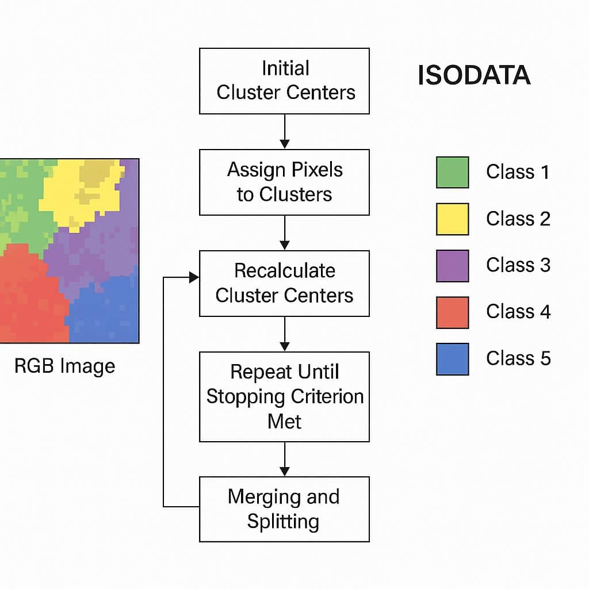
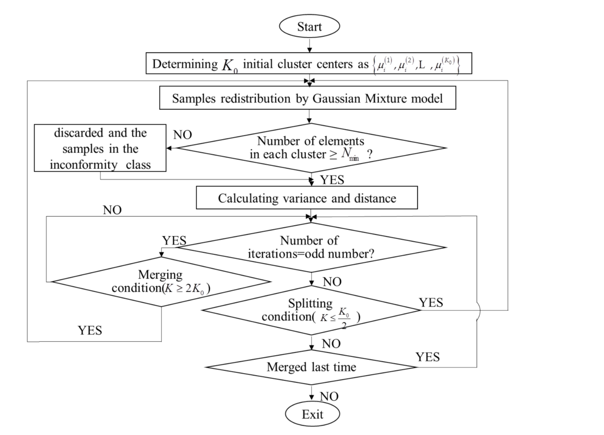
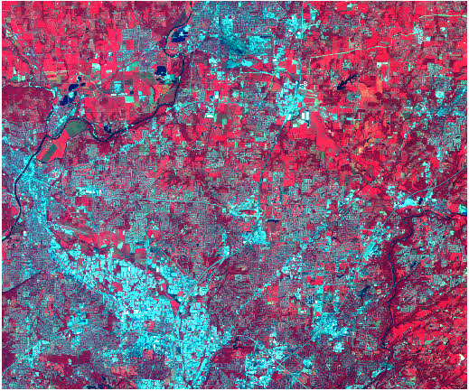
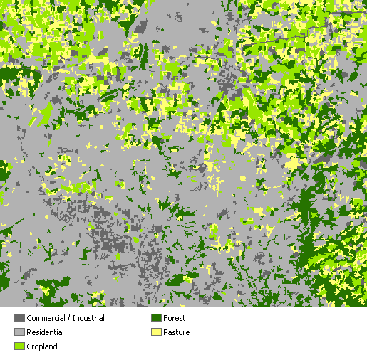
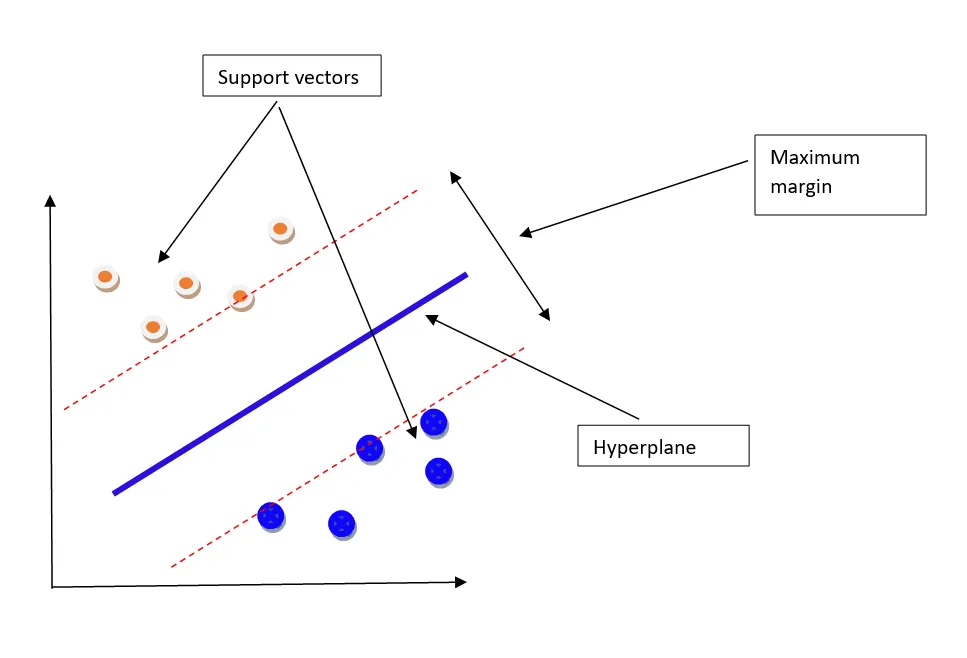
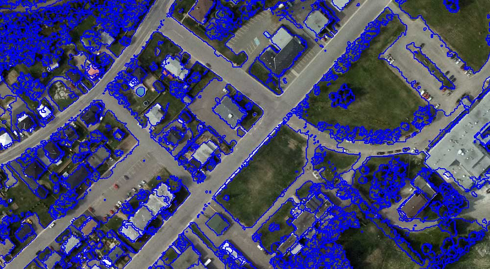
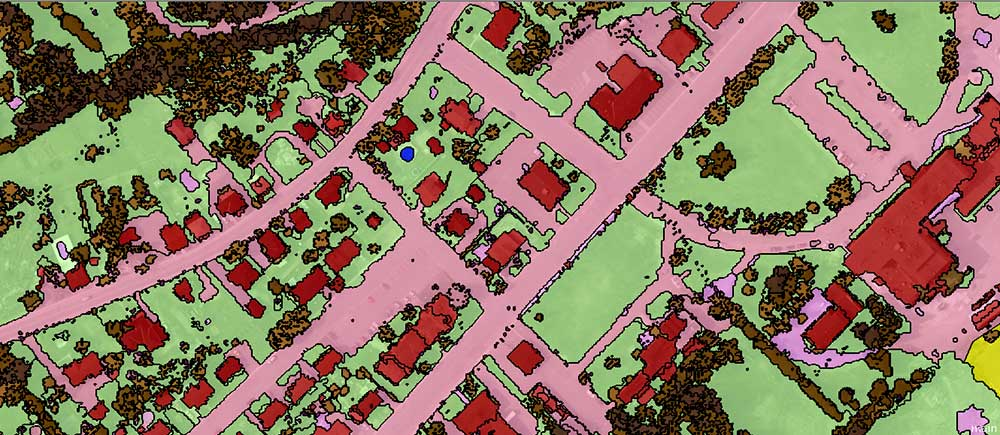

## Summary & Application

### What are the fundamental differences between **supervised and unsupervised classification** in terms of **data requirements** and the **training process**?

| Feature | Supervised Machine Learning | Unsupervised Machine Learning |
|:-----------------------|:-----------------------|:-----------------------|
| **Definition** | Model is trained on **labeled data**; each example is paired with an output label. | Model is trained on **unlabeled data**; it seeks hidden patterns or structures. |
| **Purpose** | To predict specific outputs for new data based on learned relationships (**Classification/Regression**). | To discover underlying structures or natural groupings (**Clustering/ Dimensionality Reduction**). |
| **Data** | **annotated dataset** where the "correct answer" is known. | raw data where **no labels** are provided. |
| **RS** | Sample point is labeled as "Forest," "Urban," or "Water." | Pixels are grouped by **spectral similarity**. |
| **Training Process** | Algorithm learns by mapping input features directly to the target label. | Algorithm explores the data independently to find natural clusters without external guidance. |
| **Analytical Output** | A predictive model capable of assigning specific classes to unseen data. | A set of clusters or segments revealing internal data relationships. |
| **RS Output** | **classified map** | A **segmented map** |
| **Key Applications** | Land cover classification, crop identification, and predictive modeling. | Exploratory data analysis, anomaly detection, and image segmentation. |

: Technical comparison of Machine Learning approaches in Earth Observation. {#tbl-ml-comparison}

### How does the **ISODATA** algorithm improve upon standard **K-means** clustering, and what is "cluster busting"?

 *Source: [gisrsstudy.com](https://gisrsstudy.com/isodata/)*

@hu2019 provides a sophisticated application of unsupervised learning to structural health monitoring, specifically addressing the limitations of standard K-means clustering by integrating the Iterative Self-Organizing Data Analysis (ISODATA) and the Gaussian Mixture Model (GMM).

Standard K-means clustering relies on simple distance-based similarity but suffers from major defects in complex engineering contexts: it requires a pre-set number of clusters (K) and is highly sensitive to initial values, which often leads to the model falling into local optimal solutions or creating clusters with too few data points, causing divergence.

The ISODATA-GMM approach introduces two fundamental improvements:\
Statistical Rigor (GMM): Unlike K-means, which assigns pixels to the nearest center, GMM assumes each cluster is a multivariate Gaussian distribution. This provides a probabilistic framework to assess the role of each variable in the clustering process.

Dynamic Self-Organization (ISODATA): To prevent the over-fitting risks of GMM, the ISODATA logic is used to "govern" the clusters dynamically.

 *Figure: Iterative logic of the ISODATA model. [@hu2019]*

-   Step 3: ISODATA Iteration: The algorithm enters a loop where it checks the number of elements in each cluster against a minimum value (N min). It then evaluates splitting conditions (if K≤K0/2) and merging conditions (if K≥2K0) based on whether the iteration count is odd or even.

-   Step 4: Sub-model Generation: Once the clusters are stable, the 24 measuring points are classified into five distinct groups. A Random Coefficient Model is then built for each group simultaneously, which reduces the number of free variables and enhances the model's generalization ability.

This methodology serves as a high-precision engineering equivalent to the "Cluster Busting" concept discussed in our remote sensing lectures. Logic of Cluster Busting: In our course, cluster busting is used when ISODATA produces clusters that are too heterogeneous to assign a single landcover meaning.

### What are the statistical assumptions of the Maximum Likelihood classifier, and how does it assign a pixel to a class?

> \[!IMPORTANT\] **Core Principle: Maximum Likelihood**
>
> The algorithm used by the Maximum Likelihood Classification tool is based on two fundamental principles: - **Normal Distribution**: The cells in each class sample in the multidimensional space are assumed to be normally distributed. - **Bayes' Theorem**: Utilizing Bayesian decision-making to assign pixels to the class with the highest probability.

**Comparison: Input Data vs. Classified Output**

The following example shows how the Maximum Likelihood Classification tool is used to perform a supervised classification of a multiband raster into five land use classes.

| Input Landsat TM Band | Classified Land Use Output |
|:----------------------------------:|:----------------------------------:|
|  |  |
| *Source: [ArcGIS Pro](https://pro.arcgis.com/en/pro-app/latest/tool-reference/spatial-analyst/how-maximum-likelihood-classification-works.htm)* | *Source: [ArcGIS Pro](https://pro.arcgis.com/en/pro-app/latest/tool-reference/spatial-analyst/how-maximum-likelihood-classification-works.htm)* |

From the image, five land-use classes were defined in a feature class to produce the training samples: Commercial/Industrial, Residential, Cropland, Forest, and Pasture. The Create Signatures tool was used to calculate the statistics for the classes to produce a signature file.

Using the input multiband raster and the signature file, the Maximum Likelihood Classification tool is used to classify the raster cells into the five classes.

Settings used in the Maximum Likelihood Classification tool dialog box:

``` text
+-------------------------------------------------------------+
|    MAXIMUM LIKELIHOOD CLASSIFICATION TOOL CONFIGURATION     |
+-------------------------------------------------------------+
|  Input Raster Bands          : northerncincy.tif            |
|  Input Signature File        : signature.gsg                |
|  Output Multiband Raster     : landuse                      |
|  Reject Fraction             : 0.0                          |
|  A Priori Probability Weight : EQUAL                        |
|  Input A Priori Prob File    : <blank>                      |
|  Output Confidence Raster    : confidence_ras               |
+-------------------------------------------------------------+
|  Source: ESRI Spatial Analyst                               |
+-------------------------------------------------------------+
```

### How do the hyperparameters "C" and "Gamma" (Sigma) control the decision boundary in a Support Vector Machine (SVM)?

 *Source: [Medium - Support Vector Machines](https://sandundayananda.medium.com/support-vector-machines-svm-db8314e9092d)*

### What is Object-Based Image Analysis (OBIA), and what metrics beyond spectral values can it utilize for classification?

> Think objects, not pixels!!

OBIA segments pixels into homogeneous polygons (objects) before classification, which can help mitigate the "salt and pepper" noise of pixel-based methods.

OBIA segments an image grouping small pixels together into vector objects. Instead of a per-pixel basis, segmentation automatically digitizes the image.  

 *Object-Based Image Analysis (OBIA) segmentation is a process that groups similar pixels into objects*

With these segmented objects, you use their spectral, geometrical, and spatial properties to classify them into land cover.    

 *OBIA classification uses shape, size, and spectral properties of objects to classify each object*

> \[!NOTE\] **To recap, the two basic principles of OBIA are:** 1. **SEGMENTATION**: Breaking the image into objects that represent real-world features. 2. **CLASSIFICATION**: Assigning categories based on spatial, spectral, and geometric attributes.

Also, we can configure weights for all the layers we want to segment. This means that we don’t only have to segment by red, green, or blue, but we can also segment a DEM, DSM, NIR, or even LiDAR intensity.    

 *Source: [GIS Geography - OBIA Guide](https://gisgeography.com/obia-object-based-image-analysis-geobia/)*

## Application

### A. Data Preparation & Sampling

Before running a Supervised classifier, you must collect "Training Data" (merged FeatureCollections of different land covers).

``` javascript
// 1. Merge training samples into one FeatureCollection
var trainingFeatures = forest.merge(water).merge(urban).merge(agriculture);

// 2. Overlap samples onto the image to extract spectral values
var trainingData = medianImage.sampleRegions({
  collection: trainingFeatures,
  properties: ['class'], // The label property (e.g., 0, 1, 2)
  scale: 30
});

print('Training Data Samples:', trainingData.first());
```

### B. Supervised Classification (Random Forest / CART)

This process involves defining the classifier, training it on your samples, and applying it to the whole image.

``` javascript
// 1. Define and train the classifier (Example: CART - Classification and Regression Trees)
var classifier = ee.Classifier.smileCart().train({
  features: trainingData,
  classProperty: 'class',
  inputProperties: medianImage.bandNames()
});

// 2. Classify the image
var supervisedMap = medianImage.classify(classifier);

// 3. Display results
Map.addLayer(supervisedMap, {min: 0, max: 3, palette: ['green', 'blue', 'red', 'yellow']}, 'Supervised LULC');
```

### C. Unsupervised Classification (K-Means Clustering)

Used for exploratory analysis when labels are unavailable. It groups pixels based on spectral similarity.

``` javascript
// 1. Sample pixels for the clusterer to learn the data distribution
var trainingSample = medianImage.sample({
  region: roi,
  scale: 30,
  numPixels: 5000
});

// 2. Instantiate the clusterer (Example: K-Means with 5 clusters)
var clusterer = ee.Clusterer.wekaKMeans(5).train(trainingSample);

// 3. Cluster the image
var unsupervisedMap = medianImage.cluster(clusterer);

// 4. Display results
Map.addLayer(unsupervisedMap.randomVisualizer(), {}, 'Unsupervised Clusters');
```

## Reflection

The transition to supervised machine learning changed how I understand the city. Instead of manually analysing a few samples, I can train a model on a small set and apply it across a much larger area, like to label 100 roofs in New York and have Google Earth Engine (GEE) predict the remaining million is a level of scale. This shift in scale is something traditional architectural methods cannot achieve. Unsupervised methods like K-Means also helped me notice patterns in the city, such as material differences and local variations, that are not easy to see directly.

At the same time, I realised how dependent the results are on data quality. The model only works as well as the samples I provide. During practice, I spent a lot of time refining training areas. Even small mistakes, like confusing shadows with water, could affect the results. Moving beyond simple thresholds like NDVI to more complex feature spaces was challenging, and it showed me that automation still requires **careful input**.

A key step for me was moving from pixel-based classification to OBIA. Pixel-based results often looked fragmented and unrealistic. After grouping pixels into meaningful units, the results became more consistent with real urban forms. This made the classification easier to interpret and closer to how we actually understand the city.

Final word, validation is essential. A map that looks correct is not always reliable. Learning about the limits of metrics like Kappa, and using measures such as F1-score and ROC curves, helped me evaluate results more carefully. I also learned that spatial data needs special treatment. Standard validation methods can give overly optimistic results, so spatial cross-validation is necessary. This process shifted my focus from visualization to building models that can be trusted.
