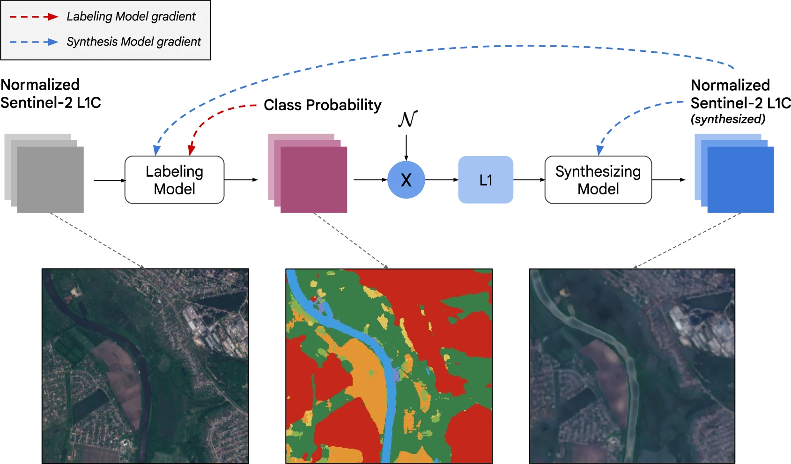
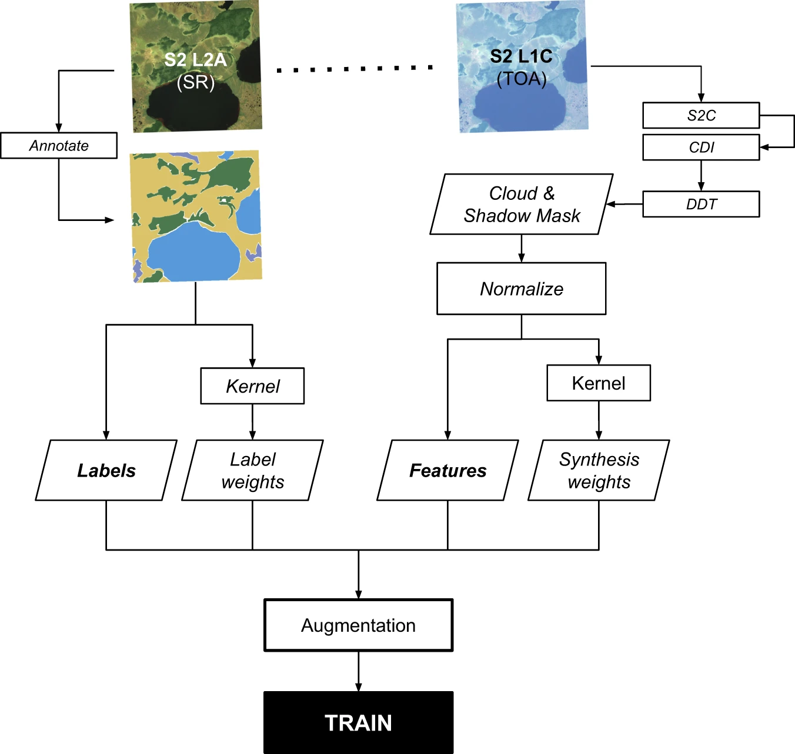
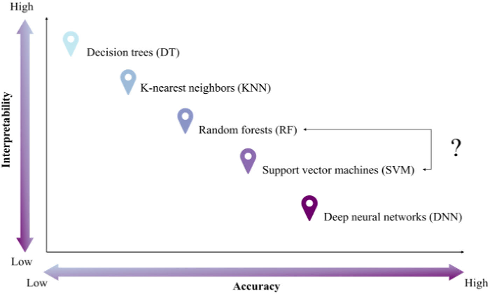

Machine Learning Architecture & Spatial Validation in Remote Sensing

## Summary & Application

### How does "Ensemble" logic solve the Overfitting Problem?

The transition from a single **Decision Tree (CART)** to a **Random Forest (RF)** represents a fundamental shift from individual hierarchical partitioning to collective intelligence. While CART is easy to interpret, it often "memorizes" the training data, leading to poor generalization.

| Aspect | Decision Tree | Random Forest |
|:-----------------------|:-----------------------|:-----------------------|
| **Model Type** | Single tree-based model | **Ensemble** of multiple trees (Bagging) |
| **Data Usage** | Uses the full training set | **Bootstrap samples** (\~70% of data used per tree) |
| **Feature Selection** | Uses all available features | Random subset of features (**Mtry**) per split |
| **Accuracy** | Prone to overfitting; lower stability | Higher accuracy; significantly reduces variance |
| **Interpretability** | High (Visualizable "if-then" rules) | Low ("Black Box" majority voting) |
| **Output** | Single prediction | **Majority Voting** across the entire forest |

**The Workflow of Ensemble Learning:**

``` text
[ Original Training Data ] 
           |
           +--[ Bootstrap Sample 1 ] --> [ Tree 1 ] --+
           |                                          |
           +--[ Bootstrap Sample 2 ] --> [ Tree 2 ] --+--> [ Majority Voting ] --> [ Final Class ]
           |                                          |
           +--[ Bootstrap Sample N ] --> [ Tree N ] --+
```

### How do Hyperparameters control learning behavior?

**Hyperparameter Tuning** is the process of setting the "rules of engagement" before training begins. These parameters dictate the balance between **Bias** (underfitting) and **Variance** (overfitting).

-   **Model Hyperparameters (Specific to the architecture):**
    -   **Random Forest:** `n_estimators` (number of trees), `max_features` (Mtry), and `max_depth`.
    -   **SVM:** `C` (penalty for misclassification; large C = narrow margin) and `Gamma` (influence distance of points; high gamma = tighter clusters).
    -   **Decision Trees:** Managed via **Pruning** to remove leaves that don't improve the "Tree Score" or SSR.
-   **Algorithm Hyperparameters (Control the process):**
    -   **Learning Rate:** The step size for updating parameters.
    -   **Regularization Strength:** Penalizes large weights to prevent the model from becoming overly complex.

### Which Cross-Validation (CV) strategy is most reliable?

To ensure a model generalizes well, we use **Cross-Validation** to divide the dataset into multiple "folds," ensuring the model is tested on data it hasn't seen during training.

-   **K-Fold CV:** Data is split into $k$ equal folds. The model trains on $k-1$ and tests on the remaining 1. This repeats $k$ times.
-   **Stratified K-Fold:** Essential for imbalanced datasets (e.g., mapping rare urban wetlands); it ensures each fold maintains the same class proportions as the total population.
-   **Leave-One-Out (LOOCV):** A special case where $k$ equals the number of samples. Highly reliable for small datasets but computationally expensive for large-scale GEE tasks.

### Why moving away from the "Kappa Coefficient"?

Modern remote sensing demands more rigorous metrics than "Overall Accuracy." We now look at the **Accuracy Dimensions** defined by @barsi2018.

-   **Producer’s Accuracy (Recall):** Measures how often real-world features are correctly identified (avoiding **Errors of Omission**/Type I).
-   **User’s Accuracy (Precision):** Measures how often a category on the map actually exists on the ground (avoiding **Errors of Commission**/Type II).
-   **F1-Score:** The harmonic mean of Precision and Recall. It is the gold standard for **Application-Ready Data** (like @brown2022 Dynamic World).
-   **The Kappa Issue:** @foody2020 argues that the **Kappa Coefficient**—designed to account for "chance" agreement—is statistically unsuitable for thematic maps and should be abandoned in favour of more direct metrics like the **ROC Curve/AUC**.


*Figure 1: The iterative process of defining training samples for urban classification. [@brown2022]*


*Figure 3: Analyzing spectral signatures within training datasets to ensure class separation. [@brown2022]*

### Why is "Spatial Cross-Validation" mandatory?

Standard ML assumes data points are independent. However, **Tobler’s First Law** (Spatial Autocorrelation) states that "near things are more related than distant things."

**The Problem:** In standard K-Fold, a training point and a test point might be geographically adjacent. The model "cheats" by using proximity rather than learning actual spectral relationships, leading to overoptimistic results (@zotero-item-172).

**The Solution: Spatial Leave-One-Out (SLOO CV)** Methods advocated by @wadoux2021 use distance-based buffers to ensure the test fold is geographically isolated from the training folds.

``` text
      Standard K-Fold                     Spatial CV (SLOO)
[ P1 P2 P3 P4 P5 ]                [ P1 P2 | Buffer | P5 ]
(Points are mixed)           (Test point P5 is spatially isolated)
```

## Reflection

This week marked a fundamental shift in my spatial identity. I have moved from **seeing the world to querying it**. As an architect, I previously treated satellite imagery as a static backdrop for site analysis—essentially a high-resolution "picture." In the Google Earth Engine (GEE) environment, I now recognize that every pixel is a multi-dimensional data point waiting to be interrogated.

One of my most significant realizations is that **Object-Based Image Analysis (OBIA)** and **Superpixel segmentation (SLIC)** are the essential bridges between "pixels" and "buildings." In traditional urban analysis, we often get bogged down in the "noise" of individual pixels. By moving toward recognizing "objects," we treat the city not as a chaotic collection of dots, but as a structured environment. This allows us to classify the urban fabric in a way that aligns with physical architectural forms.

However, with great computational power comes great responsibility. **"Garbage in, garbage out"** remains the golden rule of GEE Machine Learning. If our training samples are biased or our preprocessing is flawed, the model's output is meaningless.

This brings us to a critical debate: **Often, classifiers on EO data can overcomplicate things.**

-   If there is a clear, spectral divide between bands (for example, a sharp NIR spike in healthy vegetation), **do we actually need a complex classifier?**  Can we just **threshold** the data (e.g., $NDVI > 0.4$)?
-   **Yes!** Thresholding is transparent and fast. However, the catch is scalability: if we receive new data from a different season or satellite, a static threshold might fail, whereas a trained classifier can adapt.


*Figure 2: The inherent trade-off between model interpretability and predictive accuracy. [@sheykhmousa2020]*

This is the **Interpretability-Accuracy Trade-off** [@sheykhmousa2020]. As shown in the trade-off model, as we move toward "Ensemble" methods like Random Forest to gain accuracy, we often lose the "Interpretability" that a single Decision Tree or a simple threshold provides. In urban policy, being able to explain *why* a model made a decision is often as important as the decision itself.

------------------------------------------------------------------------

To visualize this trade-off, I draft a GEE script to check "Black Box" classifier.

``` javascript
// Load Median Image for NYC
var nyc = ee.Geometry.Point([-73.97, 40.78]).buffer(5000).bounds();
var s2 = ee.ImageCollection("COPERNICUS/S2_SR_HARMONIZED")
  .filterBounds(nyc).filterDate('2023-05-01', '2023-09-30')
  .median().clip(nyc);

// 1. Method A: Simple NDVI Threshold (Highly Interpretable)
var ndvi = s2.normalizedDifference(['B8', 'B4']);
var thresholdVeg = ndvi.gt(0.4).selfMask();

// 2. Method B: Random Forest Classifier (High Accuracy/Low Interpretability)
// (Assuming 'trainingPoints' is a FeatureCollection of labeled spectral data)
var rf = ee.Classifier.smileRandomForest(50).train({
  features: trainingData,
  classProperty: 'class',
  inputProperties: ['B2', 'B3', 'B4', 'B8', 'NDVI']
});
var rfVeg = s2.addBands(ndvi).classify(rf).eq(1).selfMask();

// Compare Results
Map.addLayer(thresholdVeg, {palette: 'lime'}, 'Heuristic: NDVI > 0.4');
Map.addLayer(rfVeg, {palette: 'darkgreen'}, 'ML: Random Forest');
```
