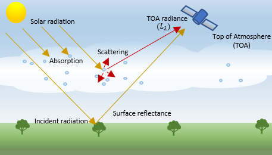
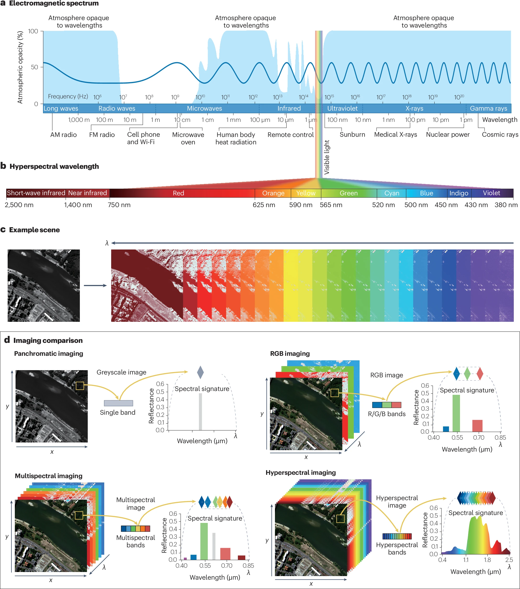
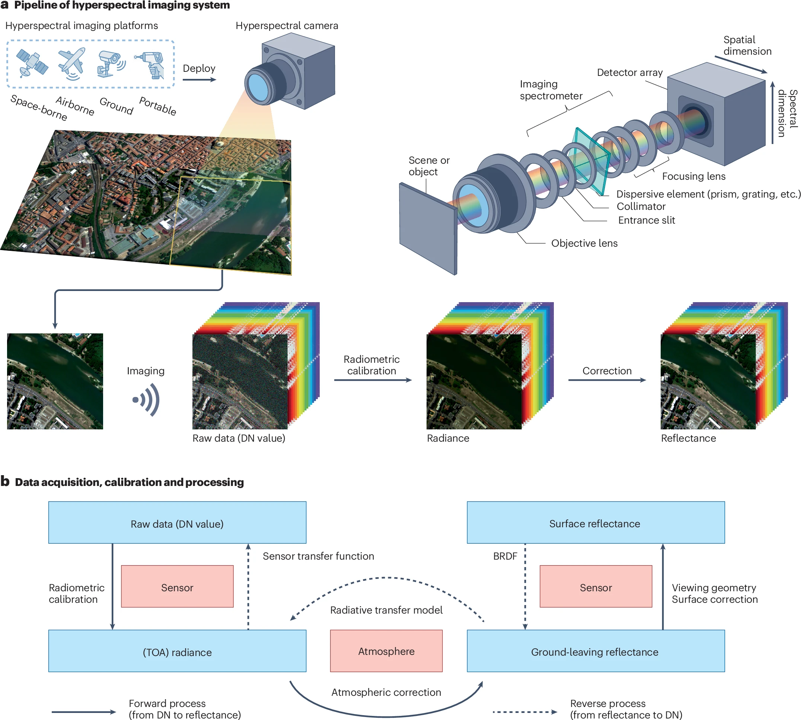
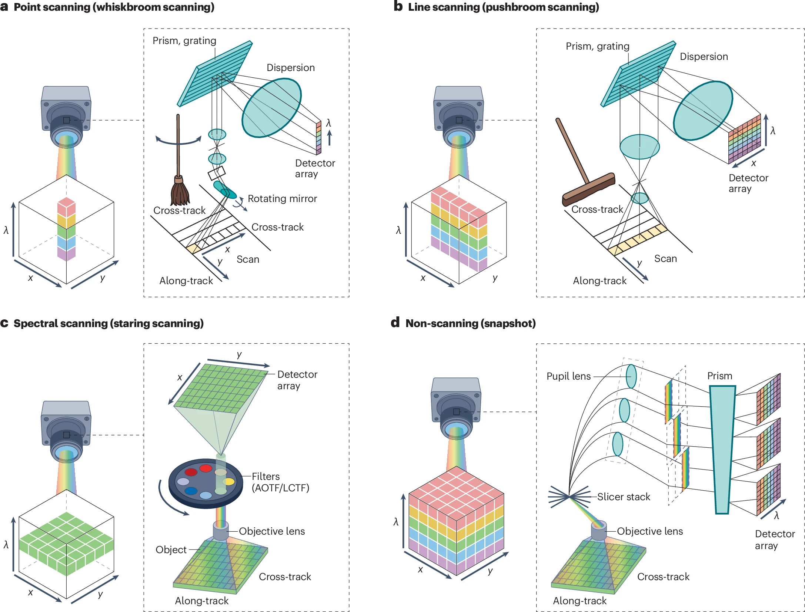
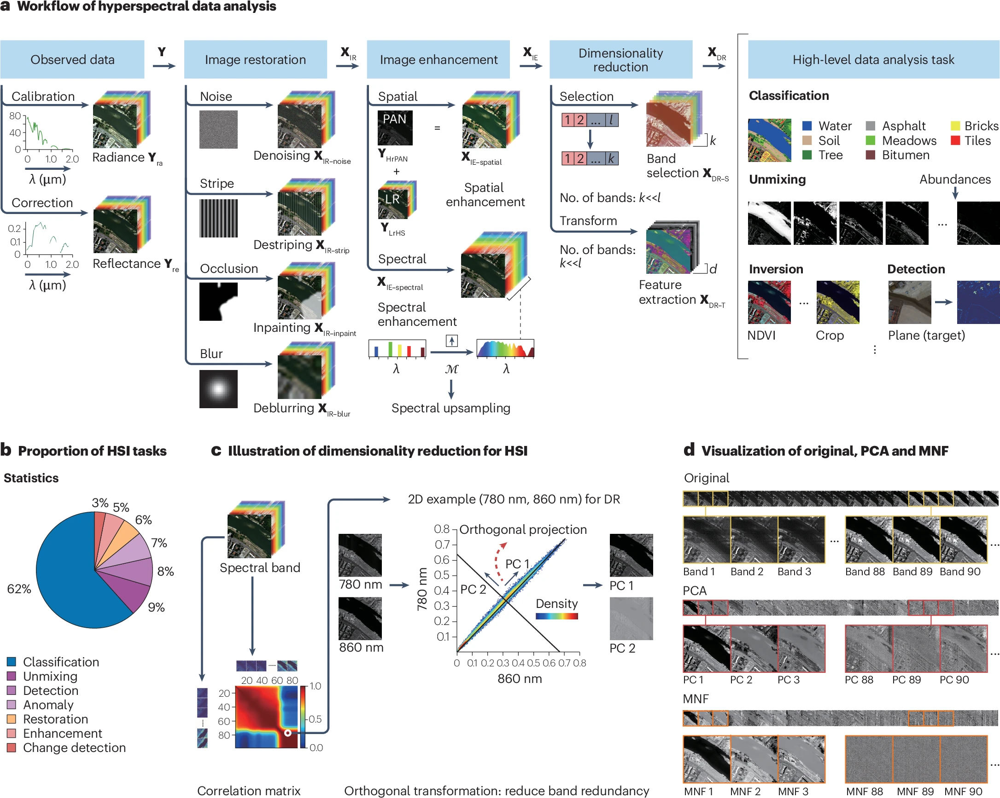
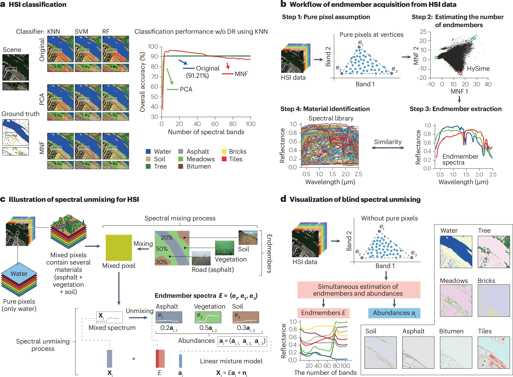
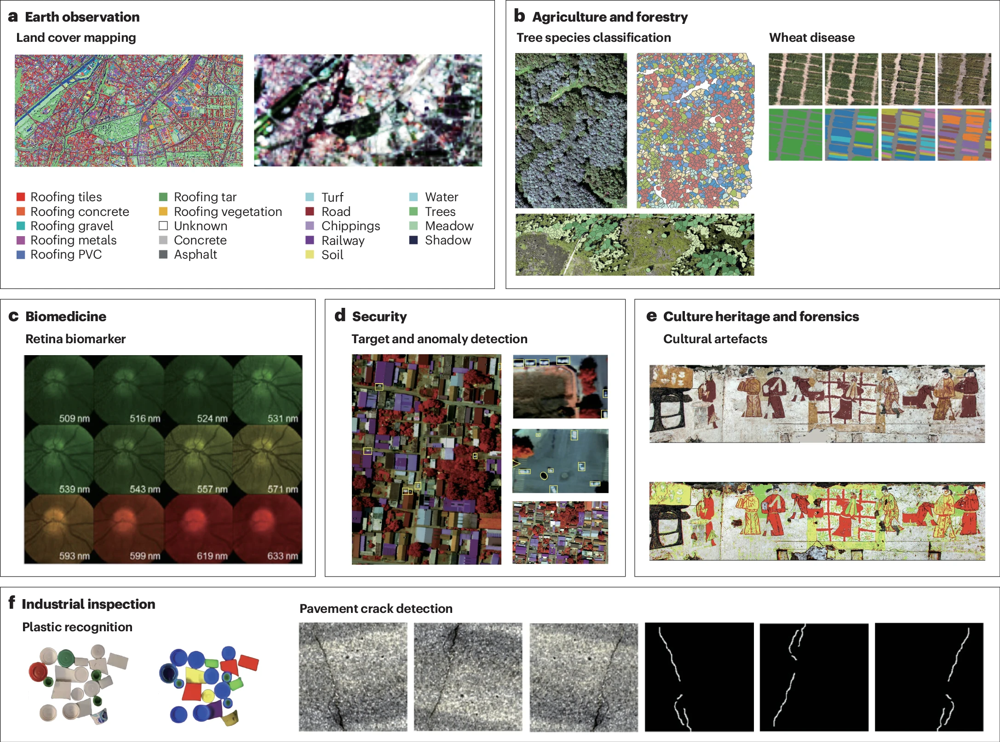

## Research Question

### What are the four fundamental resolutions of remote sensing data, and why is understanding their trade-offs critical for environmental analysis?

| Resolution Type | Definition | Technical Example | Why it Matters |
| :--- | :--- | :--- | :--- |
| **Spatial** | The size of the ground area represented by a single pixel. | **Sentinel-2** (10m) vs. **MODIS** (250m-1km) | High spatial res is needed for building footprints; low res suffices for regional weather. |
| **Spectral** | The number and width of wavelength intervals (bands) recorded. | **Multispectral** (3–10 bands) vs. **Hyperspectral** (100s of bands) | Narrow bands allow for "Spectral Unmixing" to distinguish specific mineral or vegetation types. |
| **Temporal** | The "revisit time," or how often a sensor observes the same location. | **Landsat** (16 days) vs. **PlanetScope** (Daily) | Daily revisits are essential for disaster monitoring; low frequency is fine for geology. |
| **Radiometric** | The sensor's sensitivity to subtle differences in energy (bit depth). | **8-bit** (256 levels) vs. **12-bit** (4,096 levels) | Higher bit depth allows for better detection of features in dark shadows or bright snow. |

### How do "Atmospheric Windows" and "Scattering" influence the type of data we can acquire from space?

* **Atmospheric Windows:** These are specific wavelength ranges where the atmosphere is transparent. Gases like $H_2O$, $CO_2$, and $O_3$ absorb energy in other regions, making them "opaque." Sensors must be designed to look through these specific "windows."
* **Scattering (Rayleigh & Mie):** Haze, smoke, and molecules scatter light. Rayleigh scattering (shorter wavelengths) is why the sky is blue, but it creates "noise" in blue bands that must be corrected.
* **The Active Sensor Solution:** In cloud-persistent regions (e.g., the tropics), passive optical sensors are often blocked. **Synthetic Aperture Radar (SAR)** uses microwave wavelengths that "see through" clouds, smoke, and volcanic ash.

### What is a "Spectral Signature," and how is it used to differentiate land cover types?
A **Spectral Signature** is the unique reflectance or emittance of an object across different wavelengths.

* **The Physics:** Vegetation appears green because it reflects green light, but it has a massive **Near-Infrared (NIR)** spike due to leaf cell structure (the "Red Edge").
* **Differentiation:** By comparing values across multiple bands, we can distinguish between deciduous and coniferous trees, or identify different soil types.
* **Continuous vs. Discrete:** Multispectral data provides "snapshots" at specific bands, while Hyperspectral data provides a continuous curve, enabling advanced mineral mapping.

### Why is pre-processing—specifically atmospheric and geometric correction—necessary before analyzing remotely sensed images?

1.  **Radiometric Calibration:** Converts raw Digital Numbers (DN) into a physical unit of energy (**Radiance**).
2.  **Atmospheric Correction:** Removes the "haze" caused by the atmosphere to reveal true **Surface Reflectance**.
3.  **Geometric Correction & Orthorectification:** Adjusts pixels to their correct map coordinates, accounting for terrain variations (mountains vs. valleys).
4.  **Quality Assessment (QA):** Using "Cloud Masks" to filter out pixels affected by shadows or clouds, ensuring only "clean" observations are analyzed.

*Figure: Multiple images of the same location stitched together to form a complete scene. Source: [blog.maxar.com](https://blog.maxar.com)*

### What is the fundamental difference between Radiance, Reflectance, and Top of Atmosphere (TOA) data?

| Data Level | Name | Description | Use Case |
| :--- | :--- | :--- | :--- |
| **Raw** | **Digital Number (DN)** | The raw, uncalibrated integer value recorded by the sensor. | Not suitable for cross-sensor or multi-temporal analysis. |
| **Level 1** | **Top of Atmosphere (TOA)** | Reflectance calculated at the "top" of the atmosphere. Corrects for sun angle but **not** atmospheric haze. | Quick visual checks or extremely clear sky conditions. |
| **Level 2** | **Surface Reflectance (BOA)** | The "Gold Standard." Corrects for all atmospheric interference to show what the ground actually reflects. | **Mandatory** for NDVI, change detection, and time-series analysis. |

*Figure: The impact of atmospheric correction on hyperspectral and multispectral data. Source: [MathWorks](https://www.mathworks.com/help/images/hyperspectral-and-multispectral-data-correction.html)*

## Application

According to @hong2026, a standardized methodological framework for the **Hyperspectral Imaging (HSI)** pipeline is established, centered on the acquisition of a **3D Hypercube** to capture simultaneous spatial and spectral data. This high-dimensional data structure enables non-invasive material identification through unique spectral "fingerprints."

The technical workflow transitions from raw **Digital Numbers (DN)** to **Surface Reflectance**, integrating advanced processing stages including dimensionality reduction, classification, and **spectral unmixing**. By bridging physical reflectance with machine learning, the primer demonstrates HSI’s role as a high-precision decision-support tool for urban mapping, precision agriculture, and biomedicine.

The following section provides a detailed interpretation of the article's six core figures and their connection to Hyperspectral imaging.

*Figure 1: Atmospheric constraints on spectral capture. [@hong2026]*

This figure visualizes the journey of solar radiation through the atmosphere. It directly addresses the constraints of **Atmospheric Windows** and **Scattering**, illustrating how sensors must be tuned to specific transparent wavelengths to capture the surface's true Spectral Signature. 

*Figure 2: Comparative analysis of sensor resolutions. [@hong2026]*

Fig 2 provides a comparative analysis of Spatial, Spectral, Temporal, and Radiometric resolutions. It advances the traditional "trade-off" discussion by introducing **Data Fusion**—the ability to synthetically combine sensors (e.g., merging high-spatial and high-temporal data) to overcome hardware limitations.

*Figure 3: The preprocessing transition to BOA. [@hong2026]*

Mapping the transition from raw sensor counts to **Analysis-Ready Data (ARD)**, this figure tracks the conversion from Radiance to Top-of-Atmosphere (TOA) and finally to **Surface Reflectance (BOA)**. It emphasizes that consistent, multi-temporal analysis is only possible once atmospheric interference is removed.

*Figure 4: Machine learning and OBIA workflows. [@hong2026]*

This classification moves from traditional statistics to **Object-Based Image Analysis (OBIA)** and Deep Learning. It demonstrates how algorithms utilize the "Feature Space" of spectral signatures to categorize the urban fabric, advocating for "thinking in objects" to eliminate pixel-level noise.

*Figure 5: Rigorous accuracy assessment. [@hong2026]*

Focusing on the **"Kappa Debate"** and F1-Scores, this figure addresses the pitfalls of **Spatial Autocorrelation**. It highlights that a model is only valid if it generalizes across geographically independent testing sets, ensuring that urban "suitability" maps aren't just memorizing local training points.

*Figure 6: Global synthesis and urban intervention. [@hong2026]*

The final synthesis shows how the entire pipeline drives global policy. By integrating **SAR** (for all-weather monitoring) and **Optical ARD**, remote sensing moves from descriptive mapping to **Predictive Modeling**, providing the evidence-based foundation for large-scale urban interventions like the NYC and Barcelona solar initiatives.

## Reflection

A significant "aha" moment came from the discussion on the 3D Hypercube and Spectral Unmixing. Previously, I viewed classification as assigning one label to one pixel. However, the complexity of urban environments means a 10m pixel is rarely pure. Spectral unmixing identifying the percentage of materials within a single pixel addresses my earlier confusion about why some "Vegetation" classifications looked messy, they were just dealing with Mixed Pixels.    

One area where I remain somewhat conflicted is the boundary between Correction and Enhancement. While atmospheric and geometric corrections are physically grounded and necessary, I wonder at what point enhancement starts to introduce artifacts. If we are "guessing" sub-pixel detail to make an image look sharper, are we still doing science, or are we creating a plausible visual fiction?   
