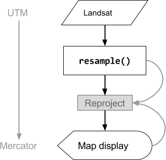
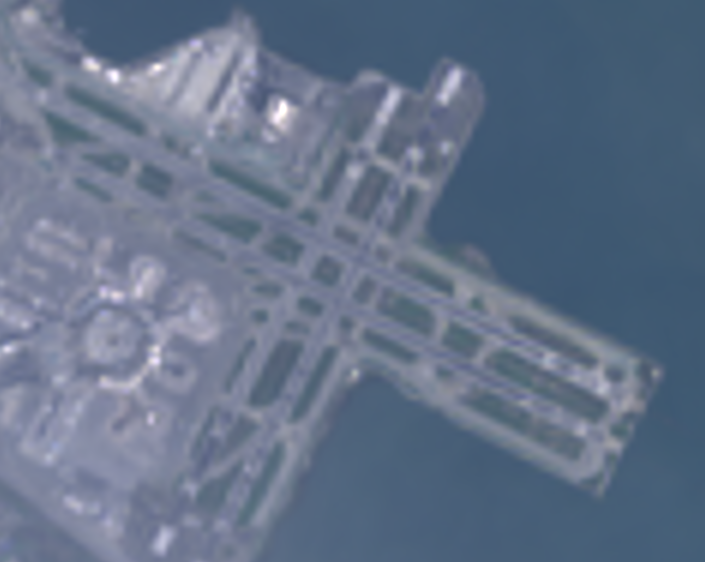
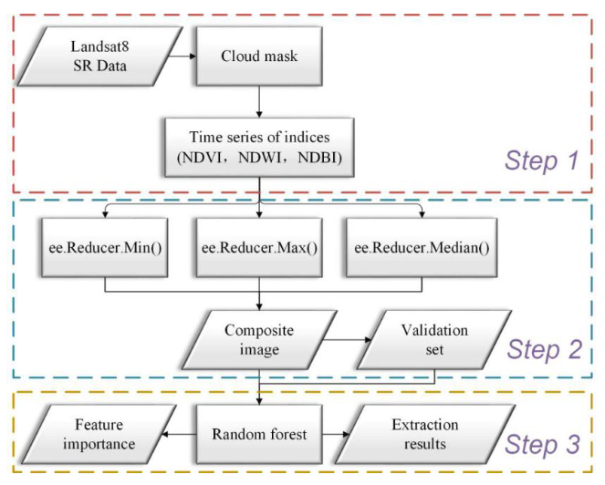
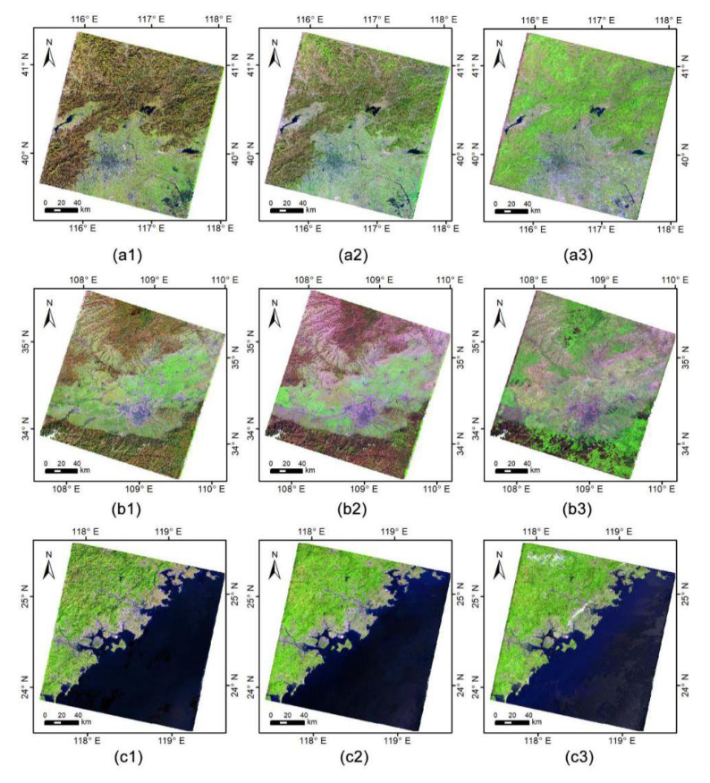

GEE is a cloud-based geospatial processing service designed for planetary-scale analysis. It eliminates local hardware constraints by storing massive datasets (like Landsat and Sentinel) on **Google’s servers** and executing computations on the **server-side** rather than on the user's local machine.

**EECU** (Earth Engine Compute Units) measures the computational resources required to execute a task or script in Google Earth Engine Server.

::: callout-note
## The `ee.` Prefix

Server-side objects in Google Earth Engine are typically prefixed with `ee.`. This indicates that they are created, stored, and manipulated on GEE's high-performance cloud infrastructure rather than your local machine.
:::

#### Examples of Server-Side Construction:

``` javascript
// 1. Accessing a collection of satellite imagery
var landsatCol = ee.ImageCollection('LANDSAT/LC08/C01/T1_SR');

// 2. Defining a spatial boundary (Vector Geometry)
var studyArea = ee.Geometry.Rectangle(-122.35, 37.77, -122.15, 37.97);

// 3. Loading a pre-defined vector dataset (FeatureCollection)
var tradeData = ee.FeatureCollection('USDA/ERS/Global_Trade');

// 4. Utilizing a specific GEE algorithm
var anomaly = ee.Algorithms.Landsat.thermalAnomaly(landsatCol.first());
```

> \[!TIP\] **Why it matters:** When you perform operations on an `ee.ImageCollection` or `ee.FeatureCollection`, you are sending instructions to the Google servers to process petabytes of data in parallel. Never use a standard JavaScript `for` loop to iterate over these; instead, use the `.map()` function to keep the computation on the server side.

## Summary

### How does the "Client-side vs. Server-side" architecture of GEE enable massive data processing?

::: callout-note
## It’s mine! BUT not really!!
:::

``` text
+------------------------------------------+               +------------------------------------------+
|          CLIENT SIDE (Browser)           |               |          SERVER SIDE (Backend)           |
|      (Frontend / User Environment)       |               |     (Google Cloud Infrastructure)        |
+------------------------------------------+               +------------------------------------------+
|                                          |               |                                          |
|   [ GEE CODE EDITOR / INTERFACE ]        |               |   [ MASSIVE GEOSPATIAL DATASTORES ]      |
|   - Collects User Input & Scripts        |               |   - Multi-Petabyte Public Data Catalog   |
|   - Manages Visualization Parameters     |               |   - Landsat, Sentinel, MODIS Archives    |
|   - Displays Final Maps & Charts         |               |   - Climate, Terrain & Vector Datasets   |
|                                          |               |                                          |
|   [ PROXY OBJECTS / DEPUTIES ]           |  REST API     |   [ GOOGLE COMPUTATION ENGINE ]          |
|   - Variables prefixed with "ee."        |  Request      |   - High-Performance Parallel Processing |
|   - Handles "Instructions," not Data     |-------------->|   - Executes Complex Spatial Algorithms  |
|   - Acts as Client-side placeholders     | (JSON Task)   |   - Map/Reduce Operations over Imagery   |
|                                          |               |   - Spatial, Temporal & Spectral Joins   |
|                                          |               |                                          |
|   [ LOCAL RENDERING ]                    |               |   [ ON-THE-FLY COMPUTATION ]             |
|   - Decodes JSON/Protocol Buffers        |   Results     |   - Processes only visible map pixels    |
|   - Renders 256x256 Map Tiles            |<--------------|   - Calculates Statistics & Reducers     |
|   - Populates Console & Inspector        | (Tiles/JSON)  |   - Scales resources based on request    |
|                                          |               |                                          |
+------------------------------------------+               +------------------------------------------+
|  STRENGTH: Low local hardware demand     |               |  STRENGTH: Planetary-scale throughput    |
+------------------------------------------+               +------------------------------------------+ 
```

### How does GEE classify and organize raster and vector data structures?

GEE utilizes specific "objects" for different data types:

-   Image: The fundamental raster data type consisting of bands

-   Feature: The fundamental vector data type consisting of a geometry and a dictionary of attributes

-   Collections: Stacks of these objects are managed as ImageCollections or FeatureCollections

### Why must researchers use "Mapping" instead of "Looping" for server-side operations?

Standard JavaScript loops run on the client-side (the browser) and cannot "see" what is inside a server-side ee object.

Mapping (using .map()) allows GEE to allocate processing to different machines in parallel, ensuring efficient analysis of massive collections without repeatedly loading data.

### How does GEE handle Scale (resolution) and Projections differently than traditional desktop GIS?

Scale: In GEE, scale is determined by the output analysis, not the input.

GEE uses an Image Pyramid logic to select the resolution closest to the analysis scale and resamples data on the fly.

Projections: Users generally do not need to worry about projections; GEE automatically converts all data into the Mercator projection (EPSG:3857) for map display.  

 *Source: [Google Earth Engine Guides](https://developers.google.com/earth-engine/guides/resample)*

::: {layout-ncol="2"}



:::

*Source: [Google Earth Engine Guides](https://developers.google.com/earth-engine/guides/resample)*

### What are "Reducers" and how do they facilitate geospatial statistics?

Reducers are objects used to summarize or aggregate data.  

-   Image Reduction: Summarizing an ImageCollection into a single image (e.g., calculating the median value of every pixel over a year).  

 *Figure: The end-to-end technical path from data ingestion to final analysis. [@zhang2021]* - Zonal Statistics: Using reduceRegion() or reduceRegions() to calculate statistics (like mean temperature) for a specific vector geometry

-   Reducer in Application

Annual Composite Images are representative datasets synthesized from a long-term sequence of satellite observations (such as Landsat or Sentinel-2) over a full year. This process relies on Reducers, which are specific objects in Google Earth Engine (GEE) used to compute statistics or perform aggregations across an ImageCollection.

As detailed in the literature, the workflow for creating these composites typically follows three stages: Data Acquisition and Pre-processing: The system ingests an entire year of multi-band imagery, filtered by date and region of interest. A critical step involves using the Quality Assessment (QA) band to mask clouds, shadows, and water, ensuring only "clean" pixels remain in the stack.\
Feature Engineering (Indices): Spectral indices like NDVI (vegetation), NDWI (water), and NDBI (built-up) are calculated for every individual image in the time series.  

 *Figure: Comparison of (1) Min, (2) Median, and (3) Max reducers (R: Band 6; G: Band 5; B: Band 3). [@zhang2021]*

@zhang2021 indicates that combining multiple reducers—such as Min, Max, and Median—provides better results for urban mapping than a single reducer. Median Reducers are the gold standard for creating haze-free, "representative" annual images. Min and Max Reducers are applied to capture phenological extremes, such as the peak of the growing season or seasonal bare-soil periods, which helps distinguish urban areas from spectral "confusers" like farmland.  

image: Annual composite images of the three districts obtained in this study ((a), (b), and (c) respectively; 1, 2, and 3 represent the results from ee.Reducer.min(), ee.Reducer.median(), and ee.Reducer.max() respectively). (R: Band 6; G: Band 5; B: Band 3). "D:\\0.CASA_USS\Jiaying-2026 portfolio-book\images\minmax.png" [@zhang2021]

## Application

This practical transitions from single-image processing to managing **Image Collections**, the core data structure in GEE for handling time-series and planetary-scale satellite data.  

> **Image Collection (`ee.ImageCollection`)**: A stack or "folder" of many `ee.Image` objects. Each image contains its own bands and metadata.

``` text
+-------------------------------------------------------------------------------+
|                      GOOGLE EARTH ENGINE (GEE) WORKFLOW                       |
+-------------------------------------------------------------------------------+
|                                                                               |
|  [ PHASE 1: DATA DOWNLOADING & FILTERING ]                                    |
|  - Access ImageCollections (Landsat, Sentinel, MODIS)                         |
|  - Spatial/Temporal Filtering (Date, Bounds, Metadata)                        |
|  - Geometry Operations (Joins, Clipping, Buffering)                           |
|                                                                               |
+-----------------------+-------------------------------------------------------+
                        |
                        v
+-------------------------------------------------------------------------------+
|  [ PHASE 2: CORE ANALYSIS & COMPUTATION ]                                     |
+-------------------------------------------------------------------------------+
|          STATISTICAL METHODS          |           MACHINE LEARNING            |
| ------------------------------------- | ------------------------------------- |
| - Zonal Statistics (e.g., Avg Temp)   | - Supervised Classification           |
| - Image/Region Reducers               | - Unsupervised Clustering             |
| - Variable Relationship Mapping       | - Deep Learning (TensorFlow)          |
+-------------------------------------------------------------------------------+
                        |
                        v
+-------------------------------------------------------------------------------+
|  [ PHASE 3: APPLICATIONS & OUTPUTS ]                                          |
+-------------------------------------------------------------------------------+
|                                                                               |
|   /-------------------\        /-------------------\       /--------------\   |
|   |   ONLINE CHARTS   |        |   SCALABLE APPS   |       |  EXPORT DATA |   |
|   | (Temporal Trends) |        |  (User Interface) |       | (Drive/Asset)|   |
|   \-------------------/        \-------------------/       \--------------/   |
|                                                                               |
+-------------------------------------------------------------------------------+
|            From raw spectral signal to multi-level layer                      |
+-------------------------------------------------------------------------------+
```

#### A. Accessing Collections

Loading a specific dataset from the GEE Data Catalog and inspecting the first available image.

``` javascript
// Accessing Landsat 8 Collection 2 Level 2 TOA dataset
var l8 = ee.ImageCollection("LANDSAT/LC08/C02/T1_TOA");

// Inspect the first image in the stack to understand its structure
print('First image metadata:', l8.first());
```

#### B. Filtering Collections

Filtering is the "Remote Control" step—narrowing down millions of images to the specific ones needed for study.

``` javascript
var startDate = '2025-01-01';
var endDate = '2025-12-31';
var poi = ee.Geometry.Point(91.79, 22.34); // Point of Interest
var maxCloud = 20;

// Chain filters for Date, Location, and Metadata (Cloud Cover)
var filteredLandsat = l8
  .filterDate(startDate, endDate)
  .filterBounds(poi)
  .filterMetadata('CLOUD_COVER', 'less_than', maxCloud);

print('Filtered Collection Size:', filteredLandsat.size());
```

#### C. Reducing Collections (Compositing)

The process of "squashing" a stack of filtered images into a single composite image. Using `median()` helps remove transient "noise" like clouds and shadows.

``` javascript
// Create a median composite
var medianComposite = filteredLandsat.median();

// Add to map - Landsat 8 bands: B4(R), B3(G), B2(B)
Map.centerObject(poi, 10);
Map.addLayer(medianComposite, {
  bands: ['B4', 'B3', 'B2'], 
  min: 0, 
  max: 3000
}, 'Median Composite');
```

#### D. Extracting Metadata

Retrieving specific properties like the acquisition date of an individual image.

``` javascript
// Select the first image from the filtered stack
var singleImage = ee.Image(filteredLandsat.first());

// Get the timestamp (system:time_start)
var timeStart = singleImage.get('system:time_start');

// Format the date into a human-readable string (YYYY-MM-dd)
var readableDate = ee.Date(timeStart).format('YYYY-MM-dd');
print('Capture Date of this image:', readableDate);
```

#### E. RGB vs. False Color

Changing the band combinations to reveal features invisible to the naked eye.

``` javascript
// 1. Natural Color (RGB): B4, B3, B2
var naturalColor = medianComposite.visualize({
  bands: ['B4', 'B3', 'B2'], 
  min: 0, 
  max: 3000
});
Map.addLayer(naturalColor, {}, 'Natural Color RGB');

// 2. False-Color Infrared: B5 (NIR), B4 (Red), B3 (Green)
// Highlights vegetation as bright red
var falseColor = medianComposite.visualize({
  bands: ['B5', 'B4', 'B3'], 
  min: 0, 
  max: 3000
});
Map.addLayer(falseColor, {}, 'False-Color Composite (NIR)');
```

::: callout-tip
## The Workflow Logic

1.  **Select**: Identify the right satellite collection (e.g., Landsat 8/9 or Sentinel-2).
2.  **Filter**: Apply spatial (bounds), temporal (date range), and quality (cloud cover) constraints.
3.  **Reduce**: Use a reducer like `ee.Reducer.median()` to "stack" multiple images and create a single "Analysis Ready" cloud-free composite.
4.  **Visualize**: Swap bands to tell different urban stories—for instance, using **False Color (NIR)** to monitor urban green space or **SWIR** to highlight built-up structures.

**Key Takeaway**: By utilizing **Server-side** filtering and reducing, we bypass the memory-hogging limitations of local processing. GEE only computes the specific pixels required for your current zoom level, effectively solving the hardware bottlenecks often encountered in desktop software like SNAP.
:::

## Reflection

I have been eagerly anticipating the introduction of Google Earth Engine (GEE), and it did not disappoint. While the introduction of JavaScript—yet another programming language to master!—felt daunting at first, I soon realized its purpose. GEE uses JavaScript as a "bridge" because it is the language of the web; it allows us to interact with Google’s cloud infrastructure through a browser without installing a single gigabyte of software. This week, the fragmented pieces of the past month finally clicked into a unified workflow.

My previous struggle with SNAP was a battle against my own hardware. I was trying to haul massive buckets of data into my local RAM, resulting in constant crashes. GEE brings a fundamental shift on **Processing vs. Requesting**. I am no longer doing the math on my computer that could lead it into crashed. I am sending a script, a instruction to Google’s servers. Also, the **Proxy Objects** has changed. When I define `var image = ee.Image(...)`, that image doesn't exist in my browser. It is a **Proxy Object**—a placeholder or a agent. Most interesting thing is GEE is "lazy" in the best way possible. It only computes exactly what is visible on my screen at that moment so I can pan across the entire globe as easily as a single city block.

One of the most striking analogies from class was the "Cooking" metaphor. GEE is like giving a chef a recipe: "Take a pot (Collection), add vegetables (Filter), boil (Reduce), and serve (Visualize)." However, this led to a major "Aha!" moment regarding limitations. I finally understood why a standard JavaScript `for-loop` (Client-side logic) fails when applied to an `ee.ImageCollection` (Server-side object). You cannot use a "local" spoon to stir a "remote" pot. To loop in GEE, you must use `.map()`, keeping the instructions within the server’s domain.

The connection between GEE and our previous work in R was a highlight. Just as we used **Principal Component Analysis (PCA)** in R to compress multi-spectral complexity, GEE **Reducers** perform a similar role. They allow us to collapse a year's worth of temporal data into a single, highly informative median image. Furthermore, the LULC (Land Use/Land Cover) theories from previous weeks have now found their "engine" in GEE’s Machine Learning library, where I can finally deploy Random Forest or CART classifiers at scale.

That's it! Hello, GEE! Couldn't help exploring more...
