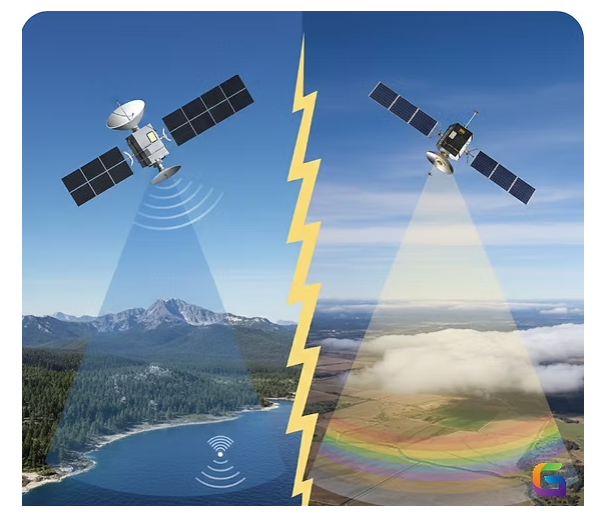
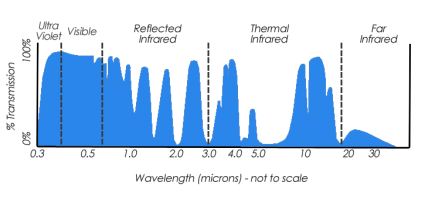
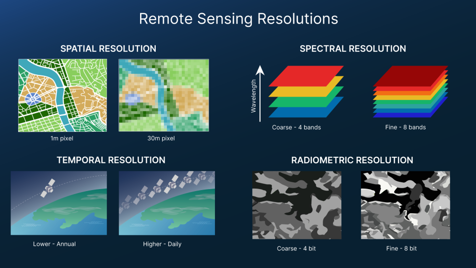
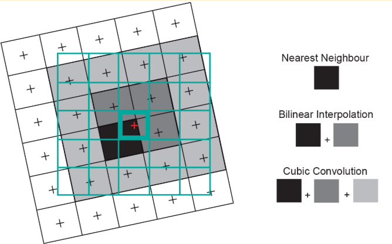
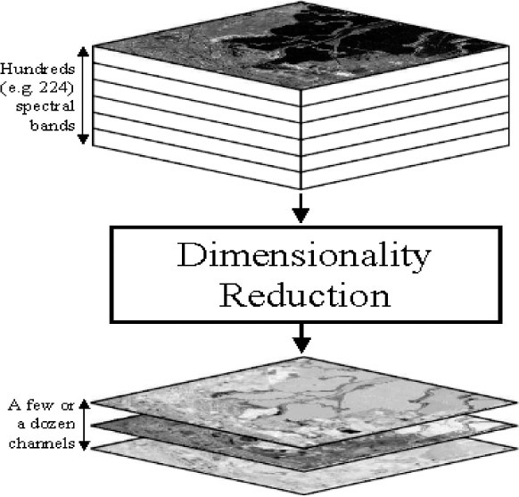

## To Start

Remote sensing is **obtaining information** about an ***object*** **from a distance**. (NASA)

It answers questions of:

- What information do you need?
- How much detail?
- How frequently do you need the data? 

::: {#fig-pruitt}
{width="30%" fig-align="center"}

**Evelyn Lord Pruitt (1918–2000)**: The geographer at the Office of Naval Research who first coined the term "remote sensing" in the 1950s to encompass aerial and satellite-based Earth observation beyond traditional photography.
:::

## Research Question

### How does the fundamental distinction between **Active and Passive sensors** determine their ability to monitor Earth **under various environmental conditions**?

| Feature | Passive Sensors (Optical) | Active Sensors (Radar/LiDAR) |
|:---|:---|:---|
| **Principle** | Detects **reflected sunlight** or emitted heat. | Emits **own energy pulse** and measures backscatter. |
| **Energy Source** | **Sunlight-dependent** (Daytime only). | **Self-powered** (Day & Night capability). |
| **Atmosphere** | Blocked by **clouds, fog, and smoke**. | **All-weather**; penetrates clouds and light rain. |
| **Visuals** | **Intuitive** (True/False color images). | **Complex** (Requires phase/amplitude processing). |
| **Examples** | Landsat, Sentinel-2, MODIS. | Sentinel-1 (SAR), LiDAR, RADARSAT. |
| **Best Use** | **Vegetation health (NDVI)** & Land cover. | **3D Terrain (DEM)** & Structural biomass. |

: Comparative analysis of Active and Passive Sensing. {#tbl-sensor-comparison}

::: {#fig-sensor-comparison}
{width="80%"}

**Active vs. Passive Sensing in Remote Sensing: Key Differences and Applications.** [Source](https://www.geowgs84.ai/post/active-vs-passive-sensing-in-remote-sensing-key-differences-and-applications)
:::

### In what ways do Atmospheric Windows and **Scattering processes** constrain the specific **wavelengths** utilized by satellite sensors?

| Scattering Type | Size Ratio (Particle : $\lambda$) | Primary Cause | Impact on Data |
|:---|:---|:---|:---|
| **Rayleigh** | **Particle $\ll$ $\lambda$** | Gas molecules (Oxygen, Nitrogen). | Causes **"Haze"**; affects shorter blue wavelengths; reduces contrast. |
| **Mie** | **Particle $\approx$ $\lambda$** | **Aerosols**, dust, smoke, pollen. | Affects specific spectral bands; common in polluted urban lower atmospheres. |
| **Non-selective** | **Particle $\gg$ $\lambda$** | **Water droplets** (Clouds, Fog). | The **"Cloud Problem"**; blocks all visible/IR light; makes surface invisible. |

: Classification of atmospheric scattering and its impact on remote sensing. {#tbl-scattering-types}

::: {.callout-note}
The Non-selective scattering mentioned in @tbl-scattering-types is the scientific reason why **Passive Sensors** (like Landsat) cannot see through clouds, whereas **Active Sensors** (like Sentinel-1 SAR) use much longer wavelengths that are unaffected by these larger water droplets, allowing for all weather imaging.
:::

Our eyes can see **red, green, and blue** which is visible light. Healthy vegetation (or chlorophyll) reflects more green light. However, it absorbs more red and blue light. That is why our eyes see plants as green. Actually, this is the principle of the **Normalized Vegetation Difference Index (NDVI)**.  

But engineers design sensors to detect **non-visible light** as well. For example, vegetation reflects **near-infrared (NIR)** which is invisible to the human eye. But sensors can pick up this **spectral information**. We can perform any type of image **classification technique** by using these principles.

::: {#fig-atmospheric-window}
{width="100%" fig-align="center"}

**The Earth’s “atmospheric window”**: The blue regions represent specific spectral bands where electromagnetic radiation can pass through the atmosphere with minimal absorption, allowing sensors to "see" the Earth's surface. [Source: GIS Geography](https://gisgeography.com/atmospheric-window/)
:::

### What is **the "Balancing Act"** involved in the four **resolutions** and how does it influence sensor selection for a project?

| Resolution Type | $\uparrow$ Increase This... | $\downarrow$ Trade-off / Decrease... | Technical Reason |
|:---|:---|:---|:---|
| **Spatial** | **Precision/Detail** (e.g., 10cm–1m) | **Swath Width & Temporal** | Small pixels capture less energy. To maintain SNR, sensors must have narrower swaths and longer revisit times. |
| **Spectral** | **Discrimination** (100+ bands) | **Spatial Resolution** | Narrow spectral bands require a larger "collecting area" per pixel to gather sufficient radiant energy. |
| **Temporal** | **Revisit Frequency** (Daily/Hourly) | **Spatial Detail** | Frequent global coverage requires a massive **Swath Width**, which forces larger pixel sizes (e.g., MODIS/500m). |
| **Radiometric** | **Sensitivity** (12-bit to 16-bit) | **Spectral Bands / Data Vol.** | Higher bit depth (4,096+ values) exponentially increases data storage and downlink requirements. |

: Synthesis of the fundamental trade-offs in remote sensing. {#tbl-resolutions-tradeoff}

::: {#fig-resolutions}
{width="100%"}

**The Four Types of Remote Sensing Resolution: Spatial, Spectral, Temporal, and Radiometric.** *Source: [NASA Earthdata - Remote Sensing Resolution](https://www.earthdata.nasa.gov/learn/earth-observation-data-basics/remote-sensing-resolution)*
:::

### Why are technical workflows like **Resampling and Dimensionality Reduction** essential for comparing **multi-source data** like Landsat and Sentinel?

Processing has become more important to create images at different resolutions and coordinate system conversions. As shown in @tbl-harmonization-steps, Without **Resampling**, spatial patterns remain blurred; without **Dimensionality Reduction**, the signal-to-noise ratio remains too low.

| Workflow Type | The Technical Challenge | The "Processed" Solution | Impact on Research |
|:---|:---|:---|:---|
| **Resampling** | **Resolution Mismatch**: Landsat (30m) vs. Sentinel-2 (10m/20m) mixed resolutions. | **Spatial Alignment**: Scaling to a common raster grid so pixels "line up" precisely. | Enables direct pixel-by-pixel statistical tests (e.g., t-tests) across sensors. |
| **Dimensionality Reduction** | **Data Overload**: High computational weight and redundancy across 9–13+ spectral bands. | **Information Compression**: Using **Tasseled Cap Transformation** (Brightness, Greenness, Wetness). | Distills ~97% of meaningful information while filtering out noise/atmospheric effects. |
| **Masking & Preprocessing** | **Inconsistent Context**: Comparing full tiles to specific study areas leads to skewed results. | **Geometric Clipping**: Applying vector masks to ensure identical geographical extents. | Guarantees that results represent the same physical features regardless of orbit. |

: Critical workflows for cross-sensor data harmonization. {#tbl-harmonization-steps}

The following figures illustrate the geometric and spectral logic behind resampling and dimensionality reduction, which are critical for harmonizing multi-source satellite data.

::: {#fig-resampling}
{width="60%"}

**Three common resampling methods: Nearest Neighbor, Bilinear Interpolation, and Cubic Convolution.** *Source: “Principles of Remote Sensing” © 2009 by ITC, Enschede*
:::

::: {#fig-dimensionality}
{width="60%"}

**Preprocessed dimensionality reduction prior to information derivation from hyperspectral imagery.** *Source: [SPIE - Dimensionality reduction of multidimensional satellite imagery](https://www.spie.org/news/3560-dimensionality-reduction-of-multidimensional-satellite-imagery)*
:::

## Application

In our practical sessions, we found that comparing Landsat and Sentinel-2 requires resampling to a common grid. This is not merely a geometric correction; it is an active engagement with the MAUP Scale Effect. By upscaling Sentinel data to match Landsat’s 30m resolution, we are essentially **re-zoning** the Earth's surface, which—as I learned in GIS—can introduce statistical bias where the variance of the data decreases as the unit size increases.

| Technical Process | GIS Equivalent (CASA0005) | Impact on Information & Policy | Supporting Evidence |
|:---|:---|:---|:---|
| **Resampling** (e.g., 10m Sentinel to 30m Landsat) | **MAUP: Scale Effect** | **Spatial Aggregation**: Larger pixels "smooth" local heterogeneities | @tbl-resolutions-tradeoff; @fig-resampling |
| **Masking & Boundary Clipping** (GADM Units) | **MAUP: Zoning Effect** | **Boundary Dependency**: Aggregating data into administrative boundary| @tbl-harmonization-steps |
| **Dimensionality Reduction** (PCA / Tasseled Cap) | **Information Compression** | **Spectral Distillation**: Reducing 13+ bands into 3 (Brightness, Greenness, Wetness) streamlines, risks discarding subtle spectral nuances| @fig-dimensionality; @tbl-harmonization-steps |

: Synthesis of Remote Sensing workflows and their GIS theoretical implications. {#tbl-technical-synthesis}

## Reflection

Coming from an architectural background, my relationship with satellite imagery was previously confined to high-resolution RGB frames for site analysis and multi-temporal historical imagery to track urban morphology. I viewed maps as "static snapshots." Discovering the "invisible maps"—the vast world of multispectral signatures—was a moment of profound revelation. Realizing that the Earth "speaks" in wavelengths beyond human vision (IR, SWIR, Thermal) has opened a hidden dimension of urban detail I previously lacked the vocabulary to describe. It is no longer just about seeing the site; it is about sensing its physical properties, from rooftop material emissivity to the subtle physiological stress of urban vegetation.   

One of the most captivating technical concepts was the Earth Observation (EO) Dashboard's dynamic scaling. The ability to seamlessly glide from a global overview to a granular streetscape is not merely a UI convenience but a sophisticated engineering feat known as the **Image Pyramid **.  

> **Technical Note:** In an Image Pyramid, data is pre-processed into a hierarchy of resolutions. When zoomed out, the system serves "low-resolution" tiles (aggregated pixels) to save bandwidth; as I scroll in, it replaces them with "high-resolution" tiles. This allows us to manage the trade-off between **Extents (breadth)** and **Precision (depth)** without crashing the browser, effectively serving as a spatial proxy for massive datasets.  

I found immense satisfaction in migrating my foundational GIS knowledge into the RS workflow. Seeing how **MAUP (Modifiable Areal Unit Problem)** manifests through pixel resampling, or how administrative masking interacts with spectral data, has created a "unified field theory" in my mind. The silos between GIS and RS are dissolving, replaced by a more holistic understanding of spatial data science where scale, signal, and boundary are deeply interconnected.  

However, the practical application remains a challenge. Working with **SNAP (SeNtinel Application Platform)** proved to be an exercise in patience and hardware management. The heavy memory consumption and local processing times raise significant questions about efficient **Memory Management** and **Cache Optimization**—technical hurdles I hope the course will address. This friction has only fueled my anticipation for **Google Earth Engine (GEE)**. The prospect of shifting from local, hardware-bound processing to cloud-based "remote manipulation" of Google’s server clusters represents a paradigm shift: moving from *processing* data to *querying* planetary-scale information.  
