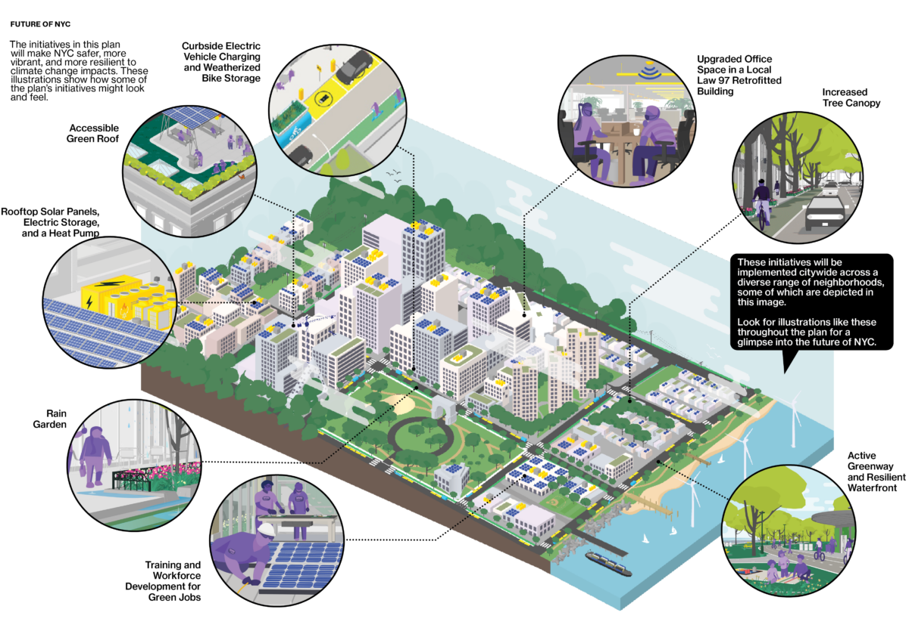
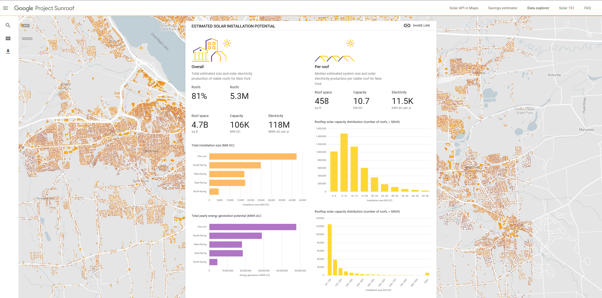
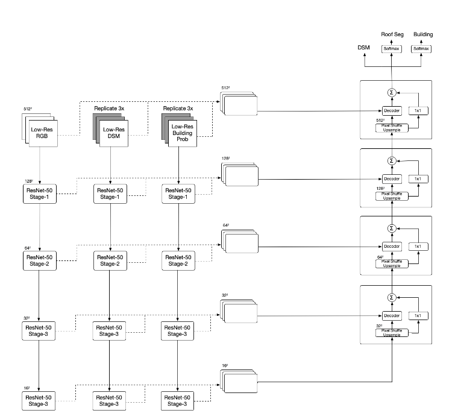
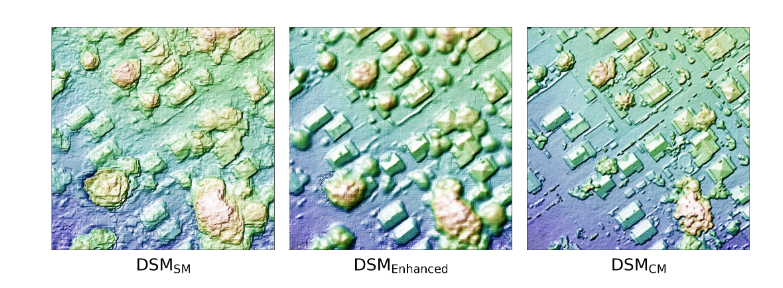
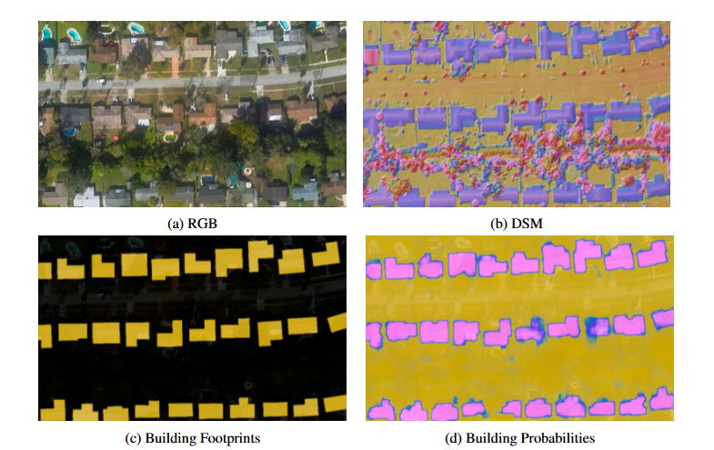
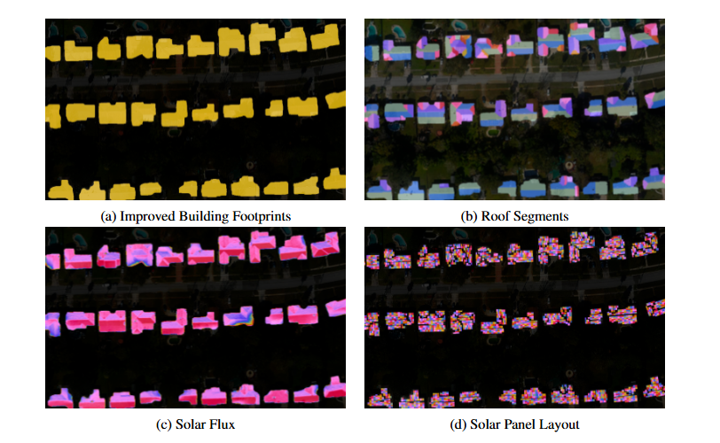

Rooftop Solar Potential and Policy–Technology Coupling in New York City

## Introduction

With buildings contributing approximately 70% of New York City's greenhouse gas emissions, the **Climate Mobilization Act** and **Local Law 97** (Greenhouse Gas Emissions Reduction) have established a legal mandate to achieve a 50% reduction in government operational emissions by 2030. 

To support this transition, **Google Project Sunroof** utilizes machine learning and aerial imagery to quantify technical solar potential by transforming high-resolution aerial data into a verifiable evidence base for policy justification. 

For example, similar assessments in the United States have utilized aerial imagery to classify rooftops by size, shading, and insolation to determine adoption potential. By enforcing **Local Laws 92 and 94** (Solar & Green Roofs), NYC successfully couples Earth Observation technology with regulatory frameworks to transform passive rooftops into strategic spatial assets and regulated distributed energy infrastructure.  


*Source: [PlaNYC 2023 Full Report](https://www.nyc.gov/assets/climate/downloads/pdfs/PlaNYC-2023-Full-Report.pdf)*


## Problem & Solution

| The Problem | The Solution | Supporting |
|:---|:---|:---|
| **Technical Uncertainty:** Implementation is marred by challenges in quantifying potential and data accessibility [@mhlanga2020]. | **3D Modeling & ML:** Using deep networks to enhance DSMs and calculate precise solar flux [@goroshin2023]. | [Mhlanga & Ercoşkun (2020)](https://dergipark.org.tr/en/pub/gujsb/issue/55231/695215) |
| **Information Gap:** Homeowners face uncertainty about roof viability or financial savings [@lemay2023]. | **Personalized Evidence:** Providing 20-year savings estimates via simple address lookup [@lemay2023]. | [Sunroof Savings Estimator](https://sunroof.withgoogle.com/about/) |
| **Data Isolation:** Traditional assessments lack "planetary-scale" foundations [@gagnon2016]. | **Policy Integration:** Linking GHI data to mandatory compliance tools like **LL97** [@zotero-item-136]. | [NREL Technical Report (2016)](https://www.nrel.gov/docs/fy16osti/65298.pdf) |

: Synthesis of barriers and remote sensing solutions for urban solar adoption. {#tbl-solar-framework}


## Policy Context

The energy transition in New York City is driven by a robust hierarchy of strategic mandates, regulatory requirements, and data-driven accountability mechanisms.  

| Category | Policy | Content | Impact |
| :--- | :--- | :--- | :--- |
| **Strategic Mandates** | **Climate Mobilization Act (2019) & PlaNYC (2023)** | Establishes a city-wide roadmap to carbon neutrality; operationalized by the Mayor’s Office of Climate and Environmental Justice (MOCEJ). | Prioritizes the maximization of climate infrastructure across the city's built environment. |
| **Regulatory Transformation** | **Local Laws 92 & 94 (2019)** | Mandates "sustainable roofing zones" for all new buildings and major roof renovations. | Legally redefines rooftops as **energy infrastructure**, requiring solar PV, green roofs, or a hybrid. |
| **Carbon Compliance** | **Local Law 97 (LL97)** | Imposes strict carbon caps on large buildings; mandates a 50% emissions reduction for City operations by 2030. | Shifts solar adoption from a voluntary choice to a **critical compliance strategy** to avoid heavy penalties. |
| **Accountability & Scale** | **Local Law 24 & LL99 (2024)** | Requires biennial solar potential assessments for City-owned buildings >10,000 sqft; codifies solar targets. | Establishes legally binding targets: **100 MW** on City properties by 2030 and **150 MW** by 2035. |
| **Barrier Removal** | **City of Yes for Carbon Neutrality (2023)** | Comprehensive modernization of NYC’s Zoning Resolution to support renewable energy. | Eliminates administrative and spatial barriers, simplifying the siting and construction of solar hardware. |
| **Social Equity** | **Environmental Justice (EJ) Framework** | Utilizes 45 indicators to identify Disadvantaged Communities (DACs). | Mandates that **55%** of solar installations be located within EJ communities to address energy burdens. |


## Earth Observation & Solar Potential Modelling

The transformation of raw aerial imagery into actionable energy intelligence follows a sophisticated five-stage pipeline, primarily driven by deep learning and geometric computer vision [@goroshin2023].


### Google Project Sunroof

For a deeper dive into Google Project Sunroof:

::: {style="width: 100%; max-width: 100%; margin-bottom: 20px;"}
<div style="position:relative; width:100%; height:0; padding-bottom:56.25%;">
  <iframe 
    src="https://player.vimeo.com/video/227237771?h=796791696b" 
    style="position:absolute; top:0; left:0; width:100%; height:100%; border-radius:8px;" 
    frameborder="0" 
    allow="autoplay; fullscreen" 
    allowfullscreen>
  </iframe>
</div>
:::

::: {style="text-align: center;"}
[View directly on Vimeo](https://vimeo.com/227237771){.btn .btn-outline-primary .btn-sm}
:::


If you enter the address of a residence in a covered region of the US, the Google Project Sunroof website shows you the following **estimates**:  
- How much sunlight the house receives annually  
- How much space the roof has for a solar installation  
- How much savings, in US dollars, the home can expect over the 20 year life of a solarsystem  
- The average monthly electricity bill for homes in your area, which you can adjust for your home  
- A recommended size, measured in kilowatts (kW), for a solar system on the house  

{#fig-sunroof-nyc}
*Source: [Google Project Sunroof Data Explorer (NYC)](https://sunroof.withgoogle.com/data-explorer/place/ChIJqaUj8fBLzEwRZ5UY3sHGz90/)*


### Technical Workflow 

Step | Phase | Action |
|:---|:---|:---|
| **Inputs** | **Data Ingestion** | High-resolution **RGB** imagery, **DSM** (Digital Surface Models), building footprints, and classification probabilities. |
| **01** | **Building Segmentation** | `footprints ← SegmentBuildings(RGB, DSM, footprints, probabilities)`<br>Refines boundaries and separates individual structures from vegetation. |
| **02** | **Roof Geometry** | **Segment roof DSM into planes**: Uses algorithms like RANSAC to identify flat surfaces and **remove obstacles** (chimneys, HVAC units, vents). |
| **03** | **Solar Simulation** | **Fast Ray-tracing**: Efficiently computes annual solar flux by simulating shadows from the surrounding environment (trees, neighboring tall buildings). |
| **04** | **System Design** | **Panel Layout Optimization**: Calculates the maximum number of panels that fit on viable planes and predicts the **power produced** (PVOUT). |
| **05** | **Economic Analysis** | **Financial Calculations**: Integrates local utility rates, net metering policies, and incentives to estimate 20-year savings. |
| **Outputs** | **Actionable Intelligence** | **Potential Solar Power** (kW/kWh) and **Total Cost Savings** ($). |

: Technical breakdown of the Google Project Sunroof processing pipeline. {#tbl-sunroof-algo}


{#fig-workflow}
*Source: @goroshin2023*

### Multi-modal Data Acquisition and Enhancement
The process begins with the ingestion of high-resolution aerial imagery (RGB), Digital Surface Models (DSM), and Digital Terrain Models (DTM).

* **Deep Learning DSM Enhancement**: Because high-resolution, centimeter-scale data is often limited, deep learning architectures—specifically a **UNet architecture with a ResNet-50 encoder backbone**—are used to enhance lower-quality sub-meter DSMs.
* **Filling Coverage Gaps**: This approach bridges the gap between widely available low-resolution data and the precise spatial detail required to resolve roof features, dramatically increasing the geographic coverage of solar potential estimates.

{#fig-dsm}
*Source: @goroshin2023*

### Roof Segmentation
* **Building Footprint Refinement**: Initial building footprints are refined using **graph-cut algorithms** to remove "tree overhangs" and separate individual residential addresses that may appear connected in raw imagery.
* **Roof Plane Partitioning**: Roof pixels in the DSM are fitted to a set of planar segments using the **RANSAC algorithm**.
* **Obstacle Removal**: The segments are refined to identify and exclude small structural features unsuitable for panel installation, such as chimneys, air vents, and air-conditioning units.

{#fig-input}
*Source: @goroshin2023*

### Solar Flux and Shading Simulation
This phase quantifies the annual solar energy received by each square meter of the roof, accounting for orientation and environmental factors.

* **Irradiance**: The system calculates Direct Normal Irradiance (DNI) and Global Horizontal Irradiance (GHI).
* **Ray-tracing**: Instead of computationally heavy traditional ray-tracing, a **linear complexity algorithm** is used to simulate hourly shadows cast by the surrounding environment, including trees and neighboring buildings.
* **Atmospheric and Thermal Corrections**: Factors such as latitude and pitch angle are integrated, and a correction factor for local air temperature and wind speed is applied to account for the decrease in PV efficiency at elevated temperatures.

### PV Outcome
The final stage translates physical potential into practical energy output and economic value.

* **Optimal Panel Layout**: The viable roof area is tiled with virtual panels to maximize both energy production and layout compactness.
* **PVOUT Computation**: This represents the practical measure of usable energy, factoring in system losses, annual efficiency degradation, and a standard DC-to-AC derate factor (typically 0.85) for inverter conversion.
* **Financial Justification**: By combining production data with local utility rates, weather patterns, and financial incentives, the tool generates a personalized 20-year savings estimate.

{#fig-output}
*Source: @goroshin2023*


## Policy–Technology Coupling Mechanism
```text
==========================================================
1. FROM DATA TO POLICY JUSTIFICATION
==========================================================
   [Aerial Imagery & LiDAR Data]
               |
               v
   { Machine Learning & 3D Modeling } <-----------+
               |                                  |
               | (Identify GHI & PVOUT)           |
               v                                  |
   [ Quantified Technical Potential ]              |
       (NYC: 8.6 GW Potential)                    |
               |                                  |
               v                                  |
   [  Evidence Base for Policy  ]                 |
               |                                  |
===============|==================================|=======
2. FROM POLICY TO IMPLEMENTATION                  |
===============|==================================|=======
               v                                  |
   [ Climate Mobilization Act / OneNYC ]          |
               |                                  |
               v                                  |
   [ Regulatory Mandates: LL92/94 & LL97 ]        |
               |                                  |
               v                                  |
     { Administrative Filter }                    | (DSM Enhancement)
      /                   \                       |
(Solar Readiness)    (Environmental Justice)      |
    /                       \                     |
   v                         v                    |
[Building-Level]        [Targeting DAC]           |
[  Deployment  ]        [ Communities ]           |
       \                    /                     |
========\==================/======================|=======
3. FEEDBACK LOOP         /                        |
=========\==============/=========================|=======
          \            /                          |
           v          v                           |
    [ Monitoring via NYC Dashboard ]              |
               |                                  |
               | (Validation Data)                |
               v                                  |
    [ Refined Deep Learning Models ] --------------+
==========================================================
```

::: {.callout-note appearance="simple"}
## Algorithm 1: Sunroof Logic
**Inputs:** RGB, DSM, building footprints, and probabilities  
1. **SegmentBuildings**: Identify precise structure boundaries.  
2. **Loop** for each building:
    - Partition DSM into roof planes; filter out obstructions.
    - Execute fast ray-tracing for solar flux (shading analysis).
    - Tile panels to compute potential power yield.
    - Run financial models based on local electricity tariffs.  
**Outputs:** Potential solar power and projected cost savings.
:::


## References

::: {#refs}
:::

